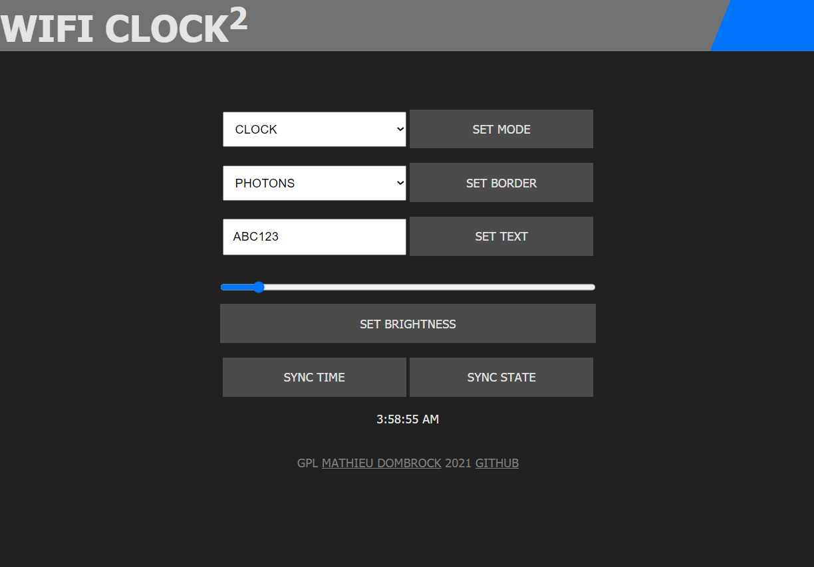
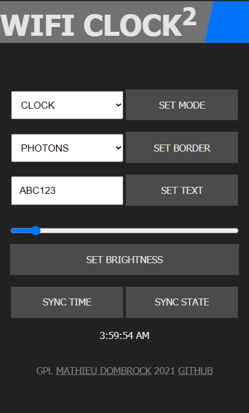
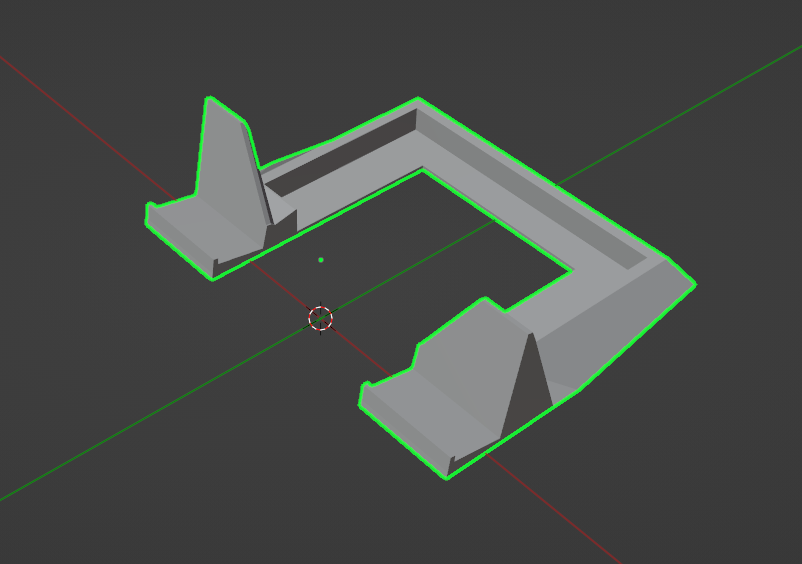

# WIFI CLOCK 2
*A WiFi enabled smart-clock for ESP32 development boards.*

This is a work in progress rewrite of my original [WiFi Clock](https://github.com/matdombrock/WIFI-Clock). It's being rewritten to use my [zIOTBP32 Biolerplate](https://github.com/matdombrock/zIOTBP32) which enabled a soft AP for confiuguring WiFi access as well as many other quality of life features. 

## Features
* Soft AP for configuring WiFi credentials.
* Serverless web based UI.
* Automatic [NTP](https://en.wikipedia.org/wiki/Network_Time_Protocol) time fetching. 
* Display local (indoor) temperature and humidity readings using an onboard sensor.
* Display external ([web based](https://github.com/chubin/wttr.in)) weather conditions.
* USB Powered.

## Required Libraries
* [ESPAsyncWebServer](https://github.com/me-no-dev/ESPAsyncWebServer)
* [Time](https://github.com/PaulStoffregen/Time)
* [MatrixGL](https://github.com/matdombrock/MatrixGL)

## Required Components
* ESP32 Dev Board
* 4x MAX72xx LED Matrix Displays
* DHT11
* Jumper cables and breadboards.  
* 3D Printer (optional)

## Wiring
All devices powered in parallel on 3.3v.

* ESP32: Pin 18 (or SCK)  -> Matrix: CLK
* ESP32: Pin 23 (or MOSI) -> Matrix: DATA
* ESP32: Pin 5 (or SS)    -> Matrix: CS
 
* ESP32: Pin 17           -> DHT: Out

## Web UI

(desktop UI)

(mobile UI)

The web UI can be accessed either from `http://<deviceIP>/app` or by directly opening the `ui/index.html` file in your browser.

## Using The API
In addition to the built-in web UI, you can also control the device directly through it's API. 

### GET /localTime
Get the local time of the clock.

### GET /border
Get the border mode value.

### GET /border?set={mode}
Set the border mode.

### GET /mode
Get the mode value.

### GET /mode?set={mode}
Set the mode.

### GET /intensity
Get the intensity (brightness) value.

### GET /intensity?set={0-15}
Set the intensity (brightness).

### GET /say
Get the value of the stored text.

### GET /say?set={text}
Set the value of the stored text. Also switches the mode to "say".

### GET /state
Get the state of the device in JSON format.

### GET /syncTime?hour={hour}&minute={minute}&second={second}
Set the time.

## More Device Images

(clock mode)

(temp/humidity mode)

(wiring)

## Printing the housing
See the [Housing README](housing)

[Preview Housing On Github](https://github.com/matdombrock/WiFi-Clock2/blob/master/housing/WiFi_Clock_Housing.stl)

