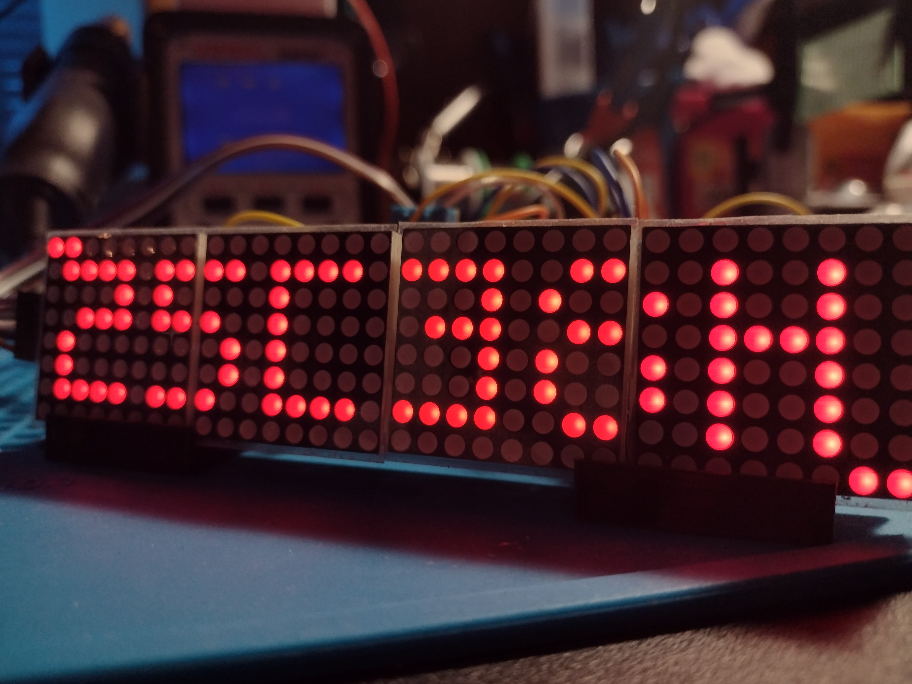

# WIFI CLOCK 2
*A WiFi enabled smart-clock for ESP32 development boards.*

This is a work in progress rewrite of my original [WiFi Clock](https://github.com/matdombrock/WIFI-Clock). It's being rewritten to use my [zIOTBP32 Biolerplate](https://github.com/matdombrock/zIOTBP32) which enabled a soft AP for confiuguring WiFi access as well as many other quality of life features. 

## Features
* Soft AP for configuring WiFi credentials.
* Serverless web based UI.
* Automatic [NTP](https://en.wikipedia.org/wiki/Network_Time_Protocol#:~:text=The%20Network%20Time%20Protocol%20(NTP,of%20the%20University%20of%20Delaware.) time fetching. 
* Display local (indoor) temperature and humidity readings using an onboard sensor.
* Display external ([web based](https://github.com/chubin/wttr.in)) weather conditions.
* USB Powered.

## Requires
* [ESPAsyncWebServer](https://github.com/me-no-dev/ESPAsyncWebServer)
* [Time](https://github.com/PaulStoffregen/Time)
* [MatrixGL](https://github.com/matdombrock/MatrixGL)

