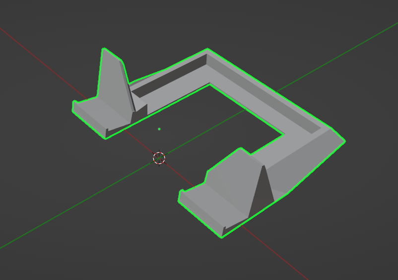

# Housing
The 3D files are located in the [housing]() directory.

You should be able to print directly from the `.stl` file but if you want to make some changes to the `.blend` you might need to change your export setting likes this:

